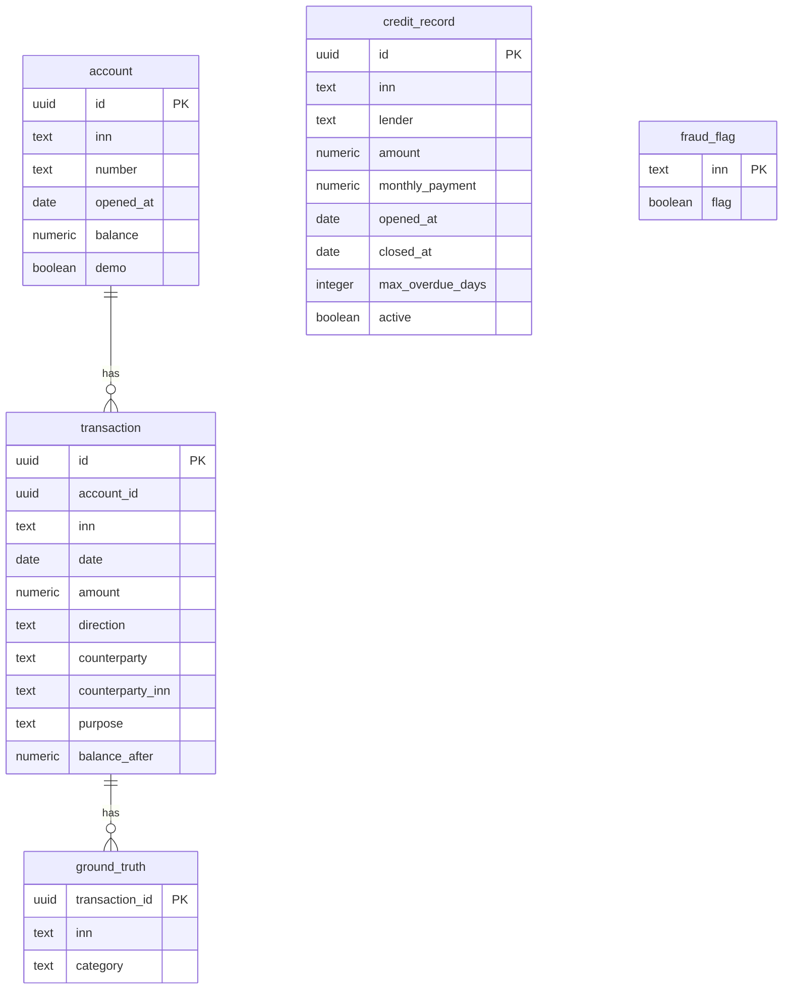

# Схема `bank` — ER-диаграмма

Файл создан скриптом `scripts/er_diagram.py` из применённых миграций (`make er-diagram`); вручную не править.

```mermaid
erDiagram
  account {
    uuid id PK
    text inn
    text number
    date opened_at
    numeric balance
    boolean demo
  }
  credit_record {
    uuid id PK
    text inn
    text lender
    numeric amount
    numeric monthly_payment
    date opened_at
    date closed_at
    integer max_overdue_days
    boolean active
  }
  fraud_flag {
    text inn PK
    boolean flag
  }
  ground_truth {
    uuid transaction_id PK
    text inn
    text category
  }
  transaction {
    uuid id PK
    uuid account_id
    text inn
    date date
    numeric amount
    text direction
    text counterparty
    text counterparty_inn
    text purpose
    numeric balance_after
  }
  transaction ||--o{ ground_truth : has
  account ||--o{ transaction : has
```
